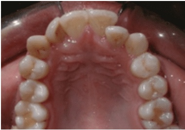
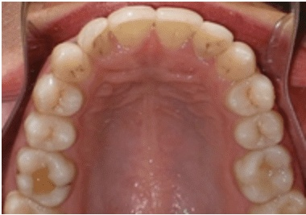
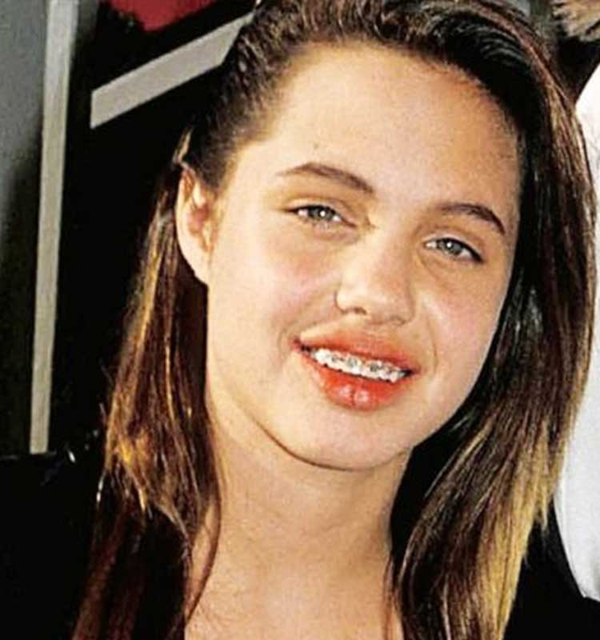
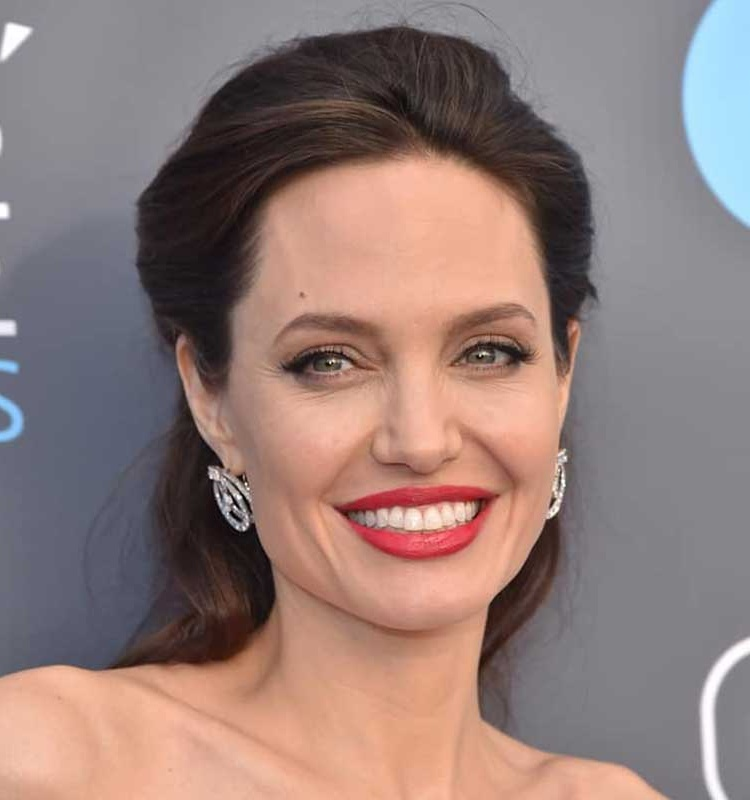
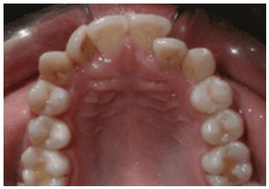

# OrthoMorph
Application of Image morphing on orthodontic before and after images

## Images
Pre Treatment            |  Post Treatment
:-------------------------:|:-------------------------:
  |  
   |  

## Final Transition Video
The thumbnail provides a quick, low-resolution sample video of how the images will morph. This allows for checking to make sure major errors will not occur and also present prospective patients with a view of how their teeth will look in the final stage.
 
    

